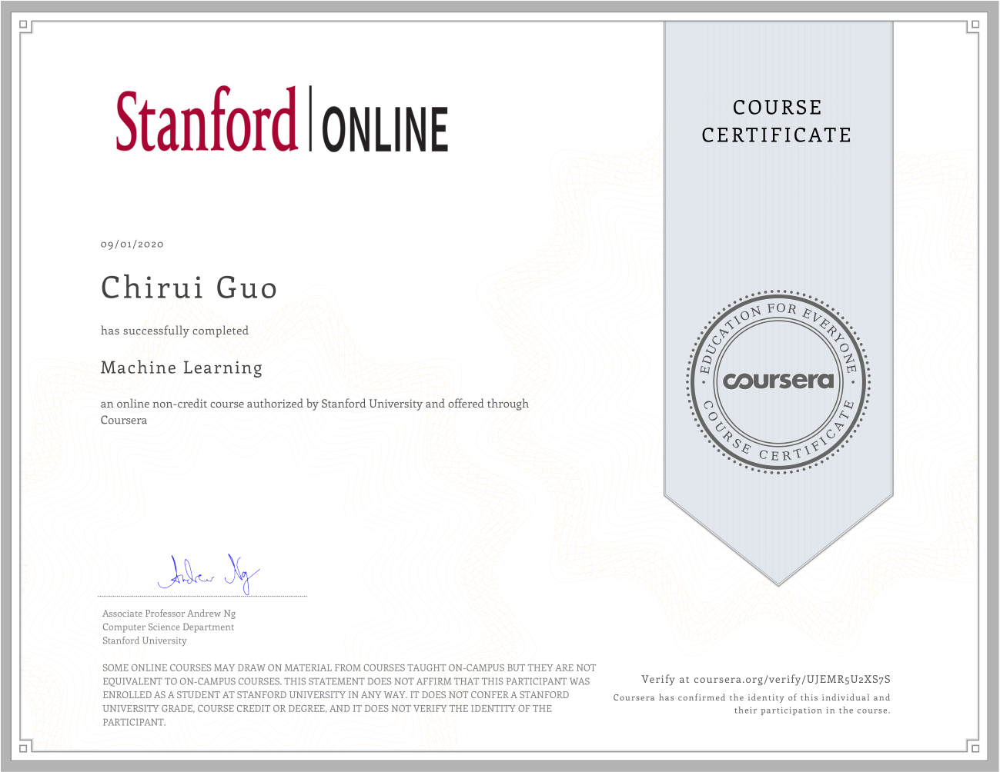

# machine_learning
This repository is my programming tasks on Coursera （Andrew NG's Machine learning course）

I have uploaded the octave code on this repository, and I will upload the Python code later.

Here is my certificate

